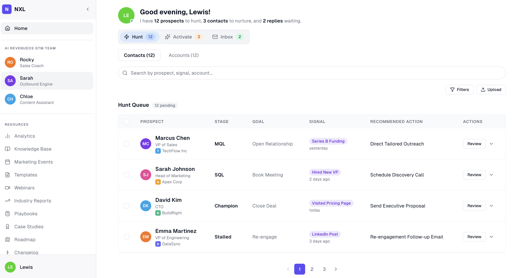

# NXL Outbound Engine: Prospect Dashboard

A B2B go-to-market workspace for sales reps. This repo holds the Outbound Engine Prospect Dashboard screen.

## Demo



## Product Context

Outbound sales reps spend most of their day juggling lists. Which prospect is hot. Which account just hired a VP. Which contact opened the pricing page yesterday. The information is scattered across CRM tabs, LinkedIn, signal tools, and Slack threads.

The Prospect Dashboard collapses that into one workspace:

- A single Hunt queue of high-intent prospects ranked by signal recency.
- Per-prospect stage, goal, and signal context so the rep does not need to context-switch to act.
- Bulk actions (mark reviewed, assign, export) so triage is fast.
- Activate and Inbox tabs alongside Hunt for the rest of the rep's daily flow.

## Business Purpose

- **Reduce rep cycle time on triage.** Less tool switching, less stale data.
- **Surface buying signals before competitors do.** Funding rounds, hiring, pricing visits, LinkedIn activity all live next to the contact.
- **Keep the rep in one screen for the whole day** so the workspace becomes the system of record for outbound, not another tab.

## Tech Stack

- React 19
- Vite 8
- TypeScript 6 (strict)
- Tailwind CSS v4
- Base UI v1.4 (`@base-ui/react`)
- React Router v7
- TanStack Query v5
- Zustand v5
- MSW v2
- lucide-react, tailwind-merge, clsx
- ESLint 10, Prettier 3, Husky 9, lint-staged 16

All deps pinned to current major (verified via `npm install @latest` and `npm outdated`). No version pulled from memory.

## Prerequisites

- Node 20.19+ or 22.12+
- npm 10 or newer

## Setup

```sh
npm install
npm run dev
```

The dev server runs at `http://localhost:5173`. You will be redirected to `/login`. Use the credentials below or click **Continue as guest**.

## Test Credentials

| Email         | Password    |
| ------------- | ----------- |
| lewis@xyz.com | password123 |
| rajat@xyz.com | password123 |

The login form is pre-filled with Lewis's credentials. **Continue as guest** also works without typing anything.

## User Flow

- **Land on `/login`.** Email + password are pre-filled with Lewis's credentials. Submit, or click **Continue as guest** to skip typing.
- **Session rehydrates on refresh.** The token persists in localStorage; on boot, `/api/me` rehydrates the user without flashing the login page.
- **Dashboard greets the rep** by name and time of day, with live counts: prospects to hunt, contacts to nurture, replies waiting.
- **Three tabs across the top:** Hunt (default, fully wired), Activate, Inbox. Switching tabs is instant and does not refetch the Hunt queue.
- **Inside Hunt:**
  - Toggle Contacts vs Accounts view.
  - Search prospects by name, signal, or account (300ms debounced).
  - Filter by Stage and Signal via the funnel popover.
  - Upload a CSV (stub. opens a confirmation dialog).
  - Paginate the queue four rows at a time.
- **Per-row actions:** click **Review** to open a stub dialog, or the chevron for the row menu.
- **Bulk actions:** select rows via checkbox, the sticky bar appears with Mark Reviewed, Assign, Export, and Clear. Selection clears automatically when you switch tabs or views.
- **Sidebar:** collapse with the chevron toggle; the state persists across reloads. Click any team member (Rocky, Sarah, Chloe) to shift the cosmetic active highlight. Resources links route to coming-soon stubs.
- **Logout:** click the avatar at the bottom of the sidebar, choose **Log out**. Token clears, query cache clears, redirected to `/login`.
- **Below 768px:** the app swaps to a mobile gate ("Built for bigger screens"). The dashboard is desktop-first by design.
- **Unknown route** (e.g. `/nonsense`): renders the 404 page with a **Go home** button.

## Security

See [SECURITY.md](SECURITY.md) for the current security posture and the hardening required before this app talks to a real backend (auth-token storage, demo prefill, security headers, rate limiting, etc.).
